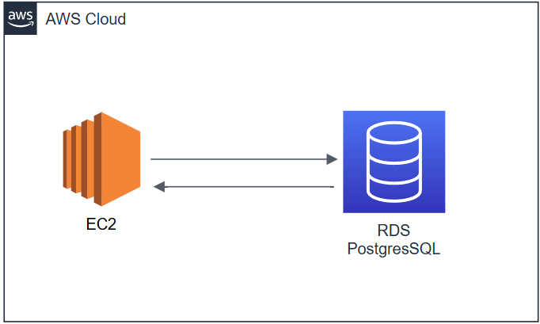

# 📦 Skumanager | Controle de SKU'S

> Organize seu catálogo de produtos de forma clara e eficiente

---

<div align="center">
    <table>
        <tbody>
            <td align="center">
                <br>
                <strong>Bem-vindo ao Skumanager!</strong><br>
                
            </td>
        </tbody>
    </table>
</div>

Se você já se perguntou como as lojas controlam seus produtos, sabendo exatamente quantos itens de uma cor ou tamanho específico possuem em estoque, a resposta geralmente envolve um SKU.

> SKU, **_Stock Keeping Unit_** i.e Unidade de Manutenção de Estoque, é um código único — como um RG — para cada variação de um produto. Por exemplo, os itens abaixo teriam SKUs diferentes:
>
> - Camiseta azul - Tamanho M
> - Camiseta azul - Tamanho G

O **Skumanager** é uma mini-plataforma, desenvolvida como parte de um desafio técnico, que simplifica a criação e o gerenciamento desses códigos individuais. O objetivo é oferecer uma **ferramenta focada para organizar seu catálogo de produtos de forma clara e eficiente**.

## 📚 Sumário

- [🚀 Requisitos](#requisitos)
- [📦 Instalação](#instalação)
- [🏗️ Estrutura do Projeto](#estrutura-do-projeto)
- [🧪 Testes](#-testes)
- [📁 Convenções e Padrões](#-convenções-e-padrões)
- [📝 Licença](#-licença)

---

## 🚀 Requisitos

Interpretador node.js versão maior ou igual a 20.0.
<br />
Docker Deamon(Engine) versão 27.4.

## 📦 Instalação

```bash
# 1. Clone o repositório com os arquivos e pastas
git clone https://github.com/ribmarciojr/skumanager-tech-challenger.git

# 2. Acesse a pasta clonada
cd skumanager-tech-challenger
```

### 🛠 Banco de Dados

```bash
# 3. Suba a instância pré-configurada do banco
docker compose -f ./docker-compose-dev.yml up
```

> 💡 Para utilizar outro serviço de banco, consulte as variáveis de ambiente definidas em:\
> `./docker-compose-dev.yml`

---

### 🔧 Back End

```bash
# 4. Navegue até a raiz da API
cd ./skumanagement/api/v1

# 5. Instale as dependências do backend
npm install

# 6. Gere os arquivos do ORM Prisma
npm run generate:db

# 7. Aplique as migrações no banco de dados
npm run migrate:db

# 8. Inicie o servidor
npm start
```

> ✅ Verifique o sucesso no terminal com a mensagem:\
> `[INFO] Server is running on http://localhost:3000`

---

### 💻 Front End

```bash
# 9. Volte para a raiz do projeto
cd ../../../..

# 10. Navegue até o diretório da interface
cd skuview

# 11. Instale as dependências do frontend
npm install

# 12. Execute o servidor de desenvolvimento
npm run dev
```

> ✅ Confira no terminal a mensagem de sucesso:\
> `✓ Ready in ...`

> 🌐 Acesse no navegador:\
> http\://localhost:3001/sku/list

<h2>Cloud Services</h2>

<div style="display: flex; align-items: center; gap: 20px; margin-bottom: 40px;">
  
  <p style="text-align: justify; margin: 0;">
    O diagrama ao lado representa a infraestrutura mínima para o projeto no contexto de cloud AWS, constando de uma
    máquina EC2, para hospedagem de UI e API, e uma instância RDS PostgreSQL, para hospedagem do serviço de banco de dados.
  </p>
</div>

<h2>Banco de Dados (UML)</h2>

<div style="display: flex; align-items: center; gap: 20px;">
    <p style="text-align: justify; margin: 0;">
        Ao lado uma imagem das entidades mapeadas no banco de dados conforme a necessidade de 
        atributos para a compreensão de um SKU.
    </p>
    
</div>

## Back-end

<br />

<div style="display: flex; align-items: center; gap: 20px;">
    
    <p style="text-align: justify; margin: 0;">
        O backend foi construído como uma API REST em Express + TypeScript, utilizando as práticas de <i>Domain Driven Design</i>(Erick Evans) e
        <i>Clean Architecture</i>(Robert Martin).
    </p>
</div>

<br />

## Front-end

<br />

<p style="text-align: justify; margin: 0;">
O frontend foi idealizado para que pontos importantes e reutilizáveis de cada página fossem criados como componentes e cada componente agrupasse seus hooks, services e tipagem necessária para lidar com os estados da aplicação de forma desacoplada.
</p>

<br />

```bash
    # Frontend Next.js 15 + TypeScript
    ├── skuview/
    │   ├── app/ # Conjunto de páginas públicas e privadas da aplicação
    │   ├── components/ # Conjunto de componentes visuais para as páginas
    │   ├── hooks/ # Hooks Tan-Stack para fazer uma requisição e lidar com estados
    │   ├── interfaces/ # Contratos de tipagem
    │   ├── errors/ # Custom erros
    │   ├── enums/ # Conjunto de enums para tipagem
    │   ├── services/ # Serviços de fetch utilizados pelos hooks
    │   └── utils/ # Algoritmos uteis para a aplicação
```
