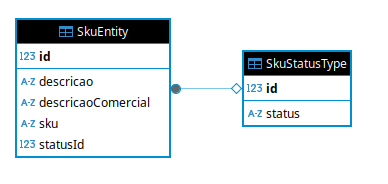
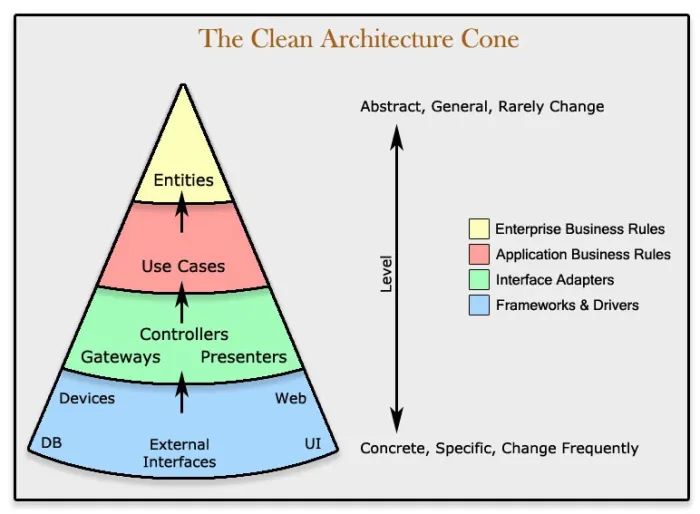

# 📦 Skumanager | Controle de SKU'S

> Organize seu catálogo de produtos de forma clara e eficiente

---

<div align="center">
<table>
<tbody>
<td align="center">
<br>
<strong>Bem-vindo ao Skumanager!</strong><br>

</td>
</tbody>
</table>
</div>


Se você já se perguntou como as lojas controlam seus produtos, sabendo exatamente quantos itens de uma cor ou tamanho específico possuem em estoque, a resposta geralmente envolve um SKU.

> SKU, ***Stock Keeping Unit*** i.e Unidade de Manutenção de Estoque, é um código único — como um RG — para cada variação de um produto. Por exemplo, os itens abaixo teriam SKUs diferentes:
> - Camiseta azul - Tamanho M
> - Camiseta azul - Tamanho G

O **Skumanager** é uma mini-plataforma, desenvolvida como parte de um desafio técnico, que simplifica a criação e o gerenciamento desses códigos individuais. O objetivo é oferecer uma **ferramenta focada para organizar seu catálogo de produtos de forma clara e eficiente**.

## 📚 Sumário

- [🚀 Requisitos](#-requisitos)
- [📦 Instalação](#-instalação)
- [🏗️ Estrutura do Projeto](#️-estrutura-do-projeto)
- [🧪 Testes](#-testes)
- [📁 Convenções e Padrões](#-convenções-e-padrões)
- [📝 Licença](#-licença)

---

## 🚀 Requisitos

Interpretador node.js versão maior ou igual a 20.0.
Docker Deamon(Engine) versão 27.4.

## 📦 Instalação

```bash
# 1. Clone o repositório com os arquivos e pastas
git clone https://github.com/ribmarciojr/skumanager-tech-challenger.git

# 2. Acesse a pasta clonada
cd skumanager-tech-challenger
```

### 🛠 Banco de Dados

```bash
# 3. Suba a instância pré-configurada do banco
docker compose -f ./docker-compose-dev.yml up
```

> 💡 Para utilizar outro serviço de banco, consulte as variáveis de ambiente definidas em:\
> `./docker-compose-dev.yml`

---

### 🔧 Back End

```bash
# 4. Navegue até a raiz da API
cd ./skumanagement/api/v1

# 5. Instale as dependências do backend
npm install

# 6. Gere os arquivos do ORM Prisma
npm run generate:db

# 7. Aplique as migrações no banco de dados
npm run migrate:db

# 8. Inicie o servidor
npm start
```

> ✅ Verifique o sucesso no terminal com a mensagem:\
> `[INFO] Server is running on http://localhost:3000`

---

### 💻 Front End

```bash
# 9. Volte para a raiz do projeto
cd ../../../..

# 10. Navegue até o diretório da interface
cd skuview

# 11. Instale as dependências do frontend
npm install

# 12. Execute o servidor de desenvolvimento
npm run dev
```

> ✅ Confira no terminal a mensagem de sucesso:\
> `✓ Ready in ...`

> 🌐 Acesse no navegador:\
> http\://localhost:3001/sku/list

## Cloud Services
<div width=100 height=100>


<p>
O diagrama ao lado representa a infraestrutura mínima para o projeto no contexto de cloud AWS, constando de uma máquina EC2, para hospedagem de UI e API, e uma instância RDS PostgreSQL, para hospedagem do serviço de banco de dados. 
</p>
</div>

<br />
<br />

 

<br />
<br />

## Banco de dados (UML)
<div>


<p>
Ao lado uma imagem das entidades mapeadas no banco de dados conforme a necessidade de 
atributos para a compreensão de um SKU.
</p>
<div>

## Back-end



├── skumanagement/        # Backend Express + TypeScript, Clean Architecture
│   ├── domain/           # Entidades de dominio;
│   ├── application/      # Casos de uso e regras de negócio;
│   ├── infra/            # Banco de dados, logs e libs externas;
│   └── http/             # Controladores, camada de requisição e respostas ao protocolo http;
    └── main/             # Configuração de framework e inicialização do socket.

## Front-end

├── skuview/              # Frontend Next.js 15 + TypeScript
│   ├── app/
│   ├── pages/
│   ├── components/
│   ├── hooks/
│   ├── interfaces/
│   ├── errors/
│   └── enums/
